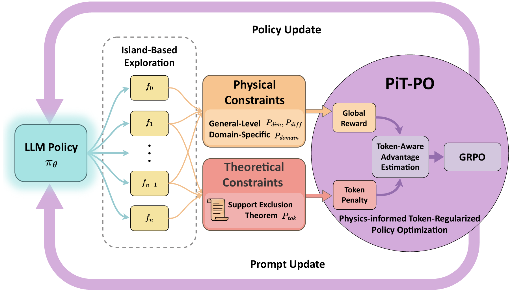

# [PiT-PO: Physics-informed Token-regularized Policy Optimization for LLM-Based Scientific Equation Discovery](https://arxiv.org/abs/2602.10576)

📄 [Paper](https://arxiv.org/abs/2602.10576)

This repository presents the open-source resources associated with the paper **PiT-PO: Physics-informed Token-regularized Policy Optimization for LLM-Based Scientific Equation Discovery**. We release the RL training framework to reproduce the results of the paper.

## 📰 News

- **[2026/05]** Our paper has been accepted by **KDD 2026 AI for Science Track**!
- **[2026/02]** Our paper is now available on [arXiv](https://arxiv.org/abs/2602.10576)!

## Overview

PiT-PO turns a Large Language Model from a *static* equation proposer into an *adaptive* generator that is fine-tuned during the search itself. It combines:

- **In-search GRPO fine-tuning** of the LLM with LoRA, driven by symbolic-regression feedback.
- **Hierarchical physical constraints** (dimensional homogeneity, differentiability, plus domain-specific priors) used as a *gated* reward signal.
- **Token-level redundancy regularization** derived from the **Support Exclusion Theorem**: redundant terms in the fitted equation are identified by the normalized coefficient ratio τᵢ = |bᵢ| / (Σⱼ|bⱼ| + ε) and penalized at the token level.
- A **multi-island evolutionary buffer** that maintains population diversity and periodically reseeds weaker islands.

Empirically, PiT-PO sets new state-of-the-art on the LLM-SR Suite and LLM-SRBench, and discovers a non-linear Reynolds-stress closure for the periodic-hill turbulent flow that out-performs the standard k–ω SST RANS baseline against DNS reference data.

## Method overview



## Repository layout

```
PiT-PO/
├── launch_grpo.py            # main entry point
├── run_experiment.sh         # one-click launcher (manages vLLM + GRPO process)
├── stop_experiment.sh
├── grpo_config.py            # training-cadence strategy presets
├── environment.yml
├── pitpo/
│   ├── pipeline.py           # search loop (samplers + evaluators + GRPO)
│   ├── buffer.py             # multi-island experience buffer
│   ├── sampler.py            # vLLM-backed local LLM + GRPO-aware sampler
│   ├── evaluator.py          # sandboxed equation evaluation + training trigger
│   ├── grpo_trainer.py       # GRPO loss, token-aware advantage, LoRA setup
│   ├── coef_penalty.py       # Support Exclusion Theorem penalty (Eq. 5–6)
│   ├── equation_functions.py # AST / dimensional / differentiability analysis
│   ├── equation_analyzer.py  # unit system + dimensional evaluator
│   └── ...
├── specs/                    # per-task problem specifications (numpy/torch)
└── data/                     # per-task train.csv / test_id.csv / test_ood.csv
```

## Installation

```bash
conda env create -f environment.yml
conda activate pitpo
```

Hardware: experiments run on a single 24 GB GPU (e.g. RTX 3090) using a Llama-3.x backbone. Two GPUs are recommended if you want to host the vLLM inference server and the LoRA fine-tuning process on separate devices.

## Quick start

Launch a full run (vLLM is started automatically by the Python process):

```bash
bash run_experiment.sh <problem> <vLLM_GPU> <GRPO_GPU> <port>
# example:
bash run_experiment.sh oscillator1 0 1 6000
```

Or invoke the Python entry point directly:

```bash
python launch_grpo.py \
    --problem oscillator1 \
    --max_samples 3000 \
    --port 6000 \
    --grpo_lr 1e-6 \
    --grpo_batch_size 4 \
    --buffer_size 100 \
    --grpo_train_every 32 \
    --device_id 0 \
    --vllm_gpu 0
```

Common arguments:

| Flag | Meaning | Default |
|---|---|---|
| `--problem` | task name; must have `specs/specification_<problem>_numpy.txt` and `data/<problem>/train.csv` | `oscillator1` |
| `--max_samples` | total number of LLM-generated equations | `3000` |
| `--grpo_lr` | LoRA fine-tuning learning rate | `1e-6` |
| `--grpo_batch_size` | GRPO group size G | `4` |
| `--grpo_train_every` | trigger one fine-tune step every N valid samples | `64` |
| `--training_strategy` | `conservative` / `adaptive` / `aggressive` / `continuous` | `continuous` |
| `--disable_grpo` | run pure prompt-evolution baseline (no fine-tuning) | off |
| `--vllm_gpu` | physical GPU id used to host the vLLM server | — |
| `--device_id` | GPU id used for LoRA fine-tuning | `0` |

Logs, reward curves, and the merged LoRA weights are written under `logs/`, `reward_curves/`, and `runs/` respectively (one timestamped subfolder per run).

To stop:

```bash
bash stop_experiment.sh                  # stop the most recent run
bash stop_experiment.sh runs/<run_dir>   # stop a specific run
```

## Adding a new task

1. Drop the data under `data/<task>/train.csv` (last column = target) and, optionally, `test_id.csv` / `test_ood.csv`.
2. Add a spec file `specs/specification_<task>_numpy.txt` defining
   - a Python skeleton decorated with `@equation.evolve` (the function to search), and
   - optionally `@evaluate.run` (a custom fitness evaluator; a default least-squares evaluator is injected if missing).
3. Run `bash run_experiment.sh <task> ...`.

## Citation

If you find this work useful, please cite:

```bibtex
@misc{wang2026llmbasedscientificequationdiscovery,
      title={LLM-Based Scientific Equation Discovery via Physics-Informed Token-Regularized Policy Optimization}, 
      author={Boxiao Wang and Kai Li and Tianyi Liu and Chen Li and Junzhe Wang and Yifan Zhang and Jian Cheng},
      year={2026},
      eprint={2602.10576},
      archivePrefix={arXiv},
      primaryClass={cs.LG},
      url={https://arxiv.org/abs/2602.10576}, 
}
```

## Acknowledgements

This codebase builds on the public LLM-SR pipeline and benchmarks (Shojaee et al., 2025), the LLM-SRBench evaluation suite, and the EvoTune-style in-search fine-tuning paradigm. We thank the authors of these projects for releasing their code and data.
